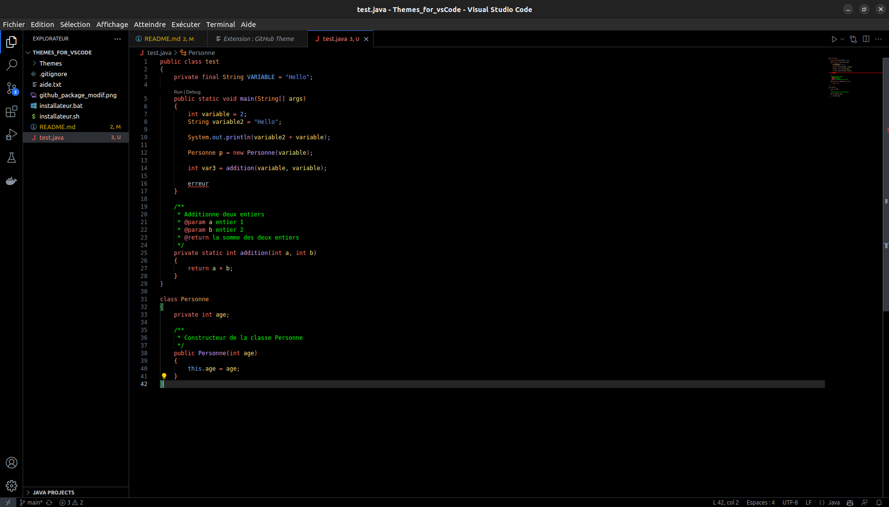
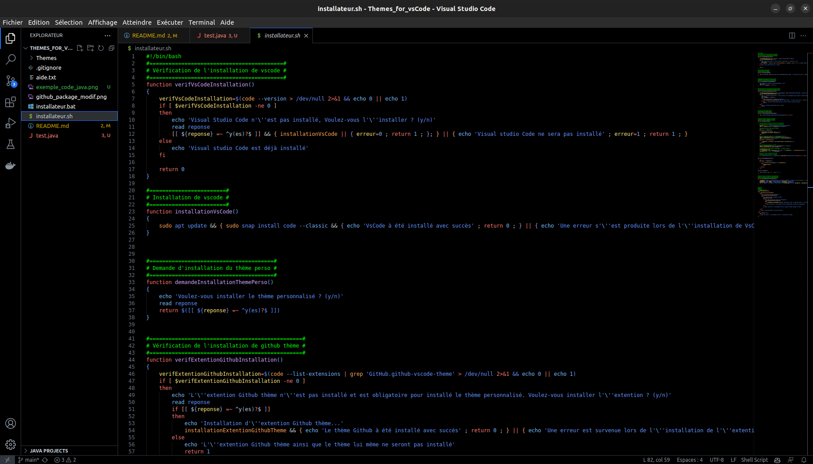

# Thème sombre avec un fond noir rgb(0,0,0) pour Visual Studio Code

## Prévisualisation

### Règle générale

Ces règles s'appliquer à tous les langages.

- Fond : `noir`
- Mot clé et type prémitif : `Rouge`
- Commentaire : `Vert`
- Texte simple et ponctuation : `Blanc`
- Fonction : `Violet`
- Variable : `Jaune`
- Constante et texte entre quote : `Bleu`
- Type personnalisé / objet : `Orange`
- Erreur : `Soulignement rouge`

### Exemple de code java et shell




## Prérequis

- Disposer des droits administrateurs si java n'est pas installer sur votre machine

## Installation sur Linux (Tester sur Ubuntu 22.04 LTS)

### Avec le script d'installation

- Cloner le repertoire Github :

  ```shell
  git clone https://github.com/FloRobart/Themes_for_vsCode.git
  ```

- Rendre le script executable :

  ```shell
  chmod +x installateur.sh
  ```

- Executer la script :

  ```shell
  ./installateur.sh
  ```

- Relancer Visual Studio Code
- Vous pouvez maintenant choisir le thème nommer `GitHub Dark Perso` dans les paramètres de l'extention Github Theme de Visual Studio Code
- Une fois le script exécuter, vous pouvez supprimer le repertoire `Themes_for_vsCode` cloner précédement


#### Manuellement

- Assurez vous d'avoir installé l'extension '`Github thème`' qui à comme ID :

  > GitHub.github-vscode-theme

  

- Cloner le repertoire Github :

  ```shell
  git clone https://github.com/FloRobart/Themes_for_vsCode.git
  ```

- Copier le thème dans le répertoire des thèmes de vscode :

  ```shell
  cp "path/to/Themes_for_vsCode/Themes/dark-perso.json" "/home/$USER/.vscode/extensions/github.github-vscode-theme-< version >/themes/dark-perso.json"
  ```

- Modifier le fichier `package.json` pour y ajouter le nouveau thème

    Ajouter le texte suivant comme dans l'exemple si dessous

  ```json
  ,
  {
      "label": "GitHub Dark Perso",
      "uiTheme": "vs-dark",
      "path": "./themes/dark-perso.json"
  }
  ```

- Exemple

  ```json
  {
      ...
  
      "contributes": {
          "themes": [
  
              ...
  
              {
                  "label": "GitHub Dark",
                  "uiTheme": "vs-dark",
                  "path": "./themes/dark.json"
              },
              {
                  "label": "GitHub Dark Perso",
                  "uiTheme": "vs-dark",
                  "path": "./themes/dark-perso.json"
              }
          ]
      },
  
      ...
  }
  ```

- Relancer Visual Studio Code
- Vous pouvez maintenant choisir le thème nommer `GitHub Dark Perso` dans les paramètres de l'extention Github Theme de Visual Studio Code
- Une fois le thème choisi, vous pouvez supprimer le repertoire `Themes_for_vsCode` cloner précédement

## Installation sur Windows (Tester sur Windows 11)

### Avec le script d'installation

- Cloner le repertoire Github :

  ```batch
  git clone https://github.com/FloRobart/Themes_for_vsCode.git
  ```

- Executer la script '`installateur.bat`' en double cliquant dessus
- Relancer Visual Studio Code
- Vous pouvez maintenant choisir le thème nommer `GitHub Dark Perso` dans les paramètres de l'extention Github Theme de Visual Studio Code
- Une fois le script exécuter, vous pouvez supprimer le repertoire `Themes_for_vsCode` cloner précédement

### Manuellement

- Assurez vous d'avoir installé l'extension '`Github thème`' qui à comme ID :

  > GitHub.github-vscode-theme

  

- Cloner le repertoire Github :

  ```shell
  git clone https://github.com/FloRobart/Themes_for_vsCode.git
  ```

- Copier le thème dans le répertoire des thèmes de vscode :

  ```batch
  xcopy "path\to\Themes_for_vsCode\Themes\dark-perso.json" "C:\Users\%USERNAME%\.vscode\extensions\github.github-vscode-theme-< version >\themes\dark-perso.json"
  ```

- Modifier le fichier `package.json` pour y ajouter le nouveau thème

    Ajouter le texte suivant comme dans l'exemple si dessous

  ```json
  ,
  {
      "label": "GitHub Dark Perso",
      "uiTheme": "vs-dark",
      "path": "./themes/dark-perso.json"
  }
  ```

- Exemple

  ```json
  {
      ...
  
      "contributes": {
          "themes": [
  
              ...
  
              {
                  "label": "GitHub Dark",
                  "uiTheme": "vs-dark",
                  "path": "./themes/dark.json"
              },
              {
                  "label": "GitHub Dark Perso",
                  "uiTheme": "vs-dark",
                  "path": "./themes/dark-perso.json"
              }
          ]
      },
  
      ...
  }
  ```

- Relancer Visual Studio Code
- Vous pouvez maintenant choisir le thème nommer `GitHub Dark Perso` dans les paramètres de l'extention Github Theme de Visual Studio Code
- Une fois le thème choisi, vous pouvez supprimer le repertoire `Themes_for_vsCode` cloner précédement
